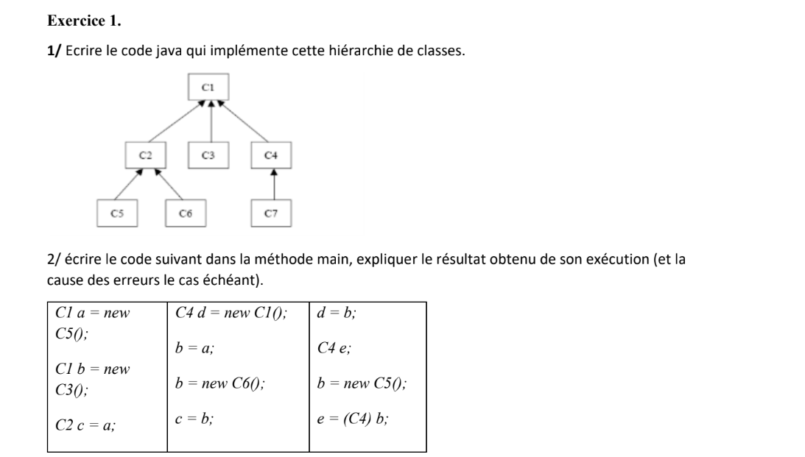

# Class Hierarchy Implementation 🔍
This repository contains the solution for Exercise 1 of a Java project. The exercise requires implementing a class hierarchy in Java based on the provided specifications.

---

# Exercise Description 📝:
The exercise involves writing Java code to implement a hierarchy of classes.
Specific instructions for creating and utilizing various class types are provided.



---

# Contents 📂:
- Main.java: Contains the main method to test the class hierarchy implementation.
- C1.java: Base class implementation.
- C2.java: Subclass of C1.
- C3.java: Subclass of C1.
- C4.java: Subclass of C1.
- C5.java: Subclass of C2.
- C6.java: Subclass of C2.
- C7.java: Subclass of C4.
  
  ---
  
# Usage 🚀:
- Clone the repository to your local machine.
  ```
  git clone "https://github.com/Kaoutherbo/Class-Hierarchy-Implementation"
  ```
- Navigate to the `src` folder
  ```
  cd src 
  ```
- Compile the Java files using a Java compiler.
  ```
  javac *.java
  ```
- Run the Main.java file to execute the test cases.
  ```
  java Main
  ```


